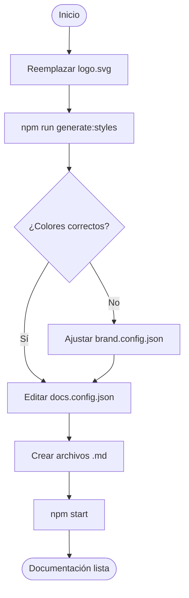
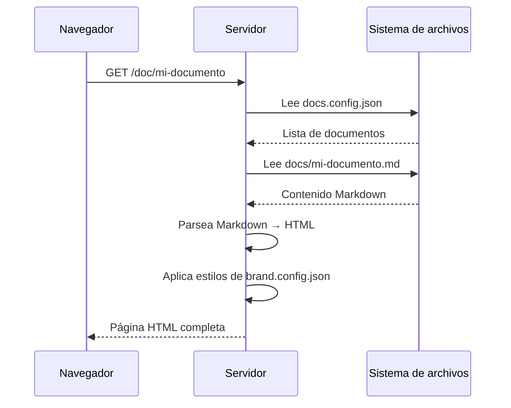

# Referencia técnica

> Reemplaza este archivo con tu documentación técnica, referencia de API o guía avanzada.

Esta sección demuestra todas las funcionalidades de formato soportadas por el visor.

## Diagramas Mermaid

### Diagrama de flujo



### Diagrama de secuencia



## Tablas de referencia

### Campos de brand.config.json

| Campo | Tipo | Descripción | Ejemplo |
|---|---|---|---|
| `primaryColor` | `string` | Color principal (sidebar, cabeceras) | `"#1a2035"` |
| `accentColor` | `string` | Color de acento (links, bordes activos) | `"#0066cc"` |
| `companyName` | `string` | Nombre de la empresa | `"Acme Corp"` |
| `docsTitle` | `string` | Subtítulo bajo el logo | `"Portal de Docs"` |
| `docsYear` | `string` | Año mostrado en el footer | `"2025"` |

### Campos de docs.config.json

| Campo | Tipo | Descripción |
|---|---|---|
| `id` | `string` | Identificador único para la URL (`/doc/{id}`) |
| `file` | `string` | Ruta al archivo `.md` relativa a la raíz |
| `title` | `string` | Título mostrado en la barra lateral |
| `subtitle` | `string` | Subtítulo descriptivo en la barra lateral |

## Bloques de código

El visor soporta resaltado de código en múltiples lenguajes:

```typescript
// TypeScript
interface Documento {
  id: string;
  titulo: string;
  contenido: string;
}

function cargarDocumento(id: string): Documento {
  return { id, titulo: 'Ejemplo', contenido: '' };
}
```

```python
# Python
def generar_reporte(datos: list[dict]) -> str:
    lineas = [f"- {d['titulo']}: {d['valor']}" for d in datos]
    return "\n".join(lineas)
```

```sql
-- SQL
SELECT
    d.id,
    d.titulo,
    COUNT(v.id) AS visitas
FROM documentos d
LEFT JOIN visitas v ON v.doc_id = d.id
GROUP BY d.id, d.titulo
ORDER BY visitas DESC;
```

## Blockquotes

> **Nota:** Los blockquotes son ideales para resaltar advertencias, tips o información importante. Se renderizan con el color de acento definido en `brand.config.json`.

> **Advertencia:** Asegúrate de que `logo.svg` sea un SVG válido con colores en formato hexadecimal (`#rrggbb`) para que el script de extracción funcione correctamente.

## Variables de entorno

| Variable | Valor por defecto | Descripción |
|---|---|---|
| `PORT` | `3000` | Puerto en el que escucha el servidor |

---

## Arquitectura del proyecto

```
proyecto/
├── src/
│   └── server.ts          ← Servidor Express + renderizado
├── scripts/
│   └── generate-styles.ts ← Extracción de colores del logo
├── docs/
│   ├── 01-introduccion.md ← Tus archivos de contenido
│   ├── 02-guia.md
│   └── 03-referencia.md
├── brand.config.json      ← Colores e identidad corporativa
├── docs.config.json       ← Registro de documentos
├── logo.svg               ← Logo de la empresa
├── package.json
└── tsconfig.json
```
