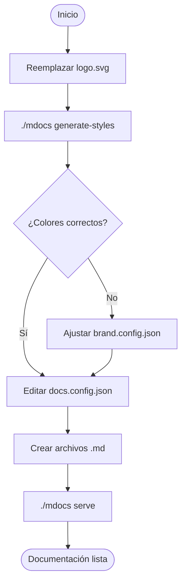

# Referencia técnica

> Reemplaza este archivo con tu documentación técnica, referencia de API o guía avanzada.

Esta sección demuestra todas las funcionalidades de formato soportadas por el visor.

## Diagramas Mermaid

### Diagrama de flujo



### Diagrama de secuencia


## Tablas de referencia

### Campos de brand.config.json

| Campo | Tipo | Descripción | Ejemplo |
|---|---|---|---|
| `primaryColor` | `string` | Color principal (sidebar, cabeceras) | `"#1a2035"` |
| `accentColor` | `string` | Color de acento (links, bordes activos) | `"#0066cc"` |
| `companyName` | `string` | Nombre de la empresa | `"Acme Corp"` |
| `docsTitle` | `string` | Subtítulo bajo el logo | `"Portal de Docs"` |
| `docsYear` | `string` | Año mostrado en el footer | `"2026"` |
| `poweredBy` | `boolean` | Atribución en el PDF | `false` |

### Campos de docs.config.json

| Campo | Tipo | Descripción |
|---|---|---|
| `id` | `string` | Identificador único para la URL (`/doc/{id}`) |
| `file` | `string` | Ruta al archivo `.md` relativa a la raíz |
| `title` | `string` | Título mostrado en la barra lateral |
| `subtitle` | `string` | Subtítulo descriptivo en la barra lateral |

### Variables de entorno

| Variable | Valor por defecto | Descripción |
|---|---|---|
| `PORT` | `3000` | Puerto en el que escucha el servidor |

## Bloques de código

El visor soporta resaltado de código en múltiples lenguajes:

```go
// Go
type Doc struct {
    ID       string `json:"id"`
    File     string `json:"file"`
    Title    string `json:"title"`
    Subtitle string `json:"subtitle"`
}

func Load(path string) ([]*Doc, error) {
    data, err := os.ReadFile(path)
    if err != nil {
        return nil, err
    }
    var docs []*Doc
    return docs, json.Unmarshal(data, &docs)
}
```

```python
# Python
def generar_reporte(datos: list[dict]) -> str:
    lineas = [f"- {d['titulo']}: {d['valor']}" for d in datos]
    return "\n".join(lineas)
```

```sql
-- SQL
SELECT
    d.id,
    d.titulo,
    COUNT(v.id) AS visitas
FROM documentos d
LEFT JOIN visitas v ON v.doc_id = d.id
GROUP BY d.id, d.titulo
ORDER BY visitas DESC;
```

## Blockquotes

> **Nota:** Los blockquotes son ideales para resaltar advertencias, tips o información importante. Se renderizan con el color de acento definido en `brand.config.json`.

> **Advertencia:** Asegúrate de que `logo.svg` sea un SVG válido con colores en formato hexadecimal (`#rrggbb`) para que el subcomando `generate-styles` funcione correctamente.

---

## Arquitectura del proyecto

```
proyecto/
├── main.go                    ← Entry point (llama a cmd/mdocs.Execute)
├── go.mod / go.sum
├── cmd/mdocs/
│   ├── root.go                ← Cobra root command
│   ├── serve.go               ← mdocs serve [--port]
│   └── styles.go              ← mdocs generate-styles
├── internal/
│   ├── brand/
│   │   ├── config.go          ← BrandConfig + HexToRGBA
│   │   └── extract.go         ← Extracción de colores del SVG
│   ├── docs/
│   │   ├── config.go          ← Doc struct + Load()
│   │   └── markdown.go        ← goldmark: Markdown → HTML
│   └── server/
│       ├── server.go          ← Rutas HTTP + pdfFilename
│       ├── render.go          ← renderPage() + renderPrint()
│       └── pdf.go             ← GeneratePDF() via chromedp
├── templates/
│   ├── page.gohtml            ← Template HTML del visor (sidebar + contenido)
│   └── print.gohtml           ← Template HTML para PDF (portada + índice + docs)
├── docs/
│   └── *.md                   ← Archivos de contenido
├── brand.config.json
├── docs.config.json
└── logo.svg
```
